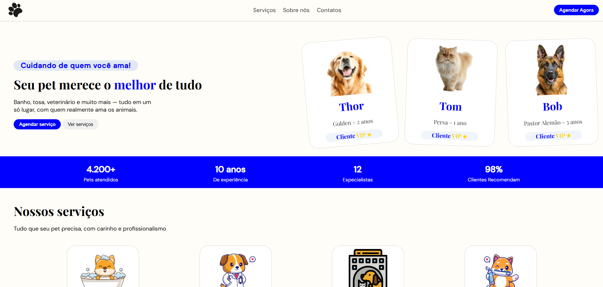

<h1 align="center"> PetShop - LandingPage</h1>

Landing page fictícia de um petshop desenvolvida como projeto de portfólio durante o segundo período do curso de Engenharia de Software.

 
 

  <a href="#-tecnologias">Tecnologias</a>&nbsp;&nbsp;&nbsp;|&nbsp;&nbsp;&nbsp;
  <a href="#-projeto">Projeto</a>&nbsp;&nbsp;&nbsp;|&nbsp;&nbsp;&nbsp;

    

 

## 🚀 Tecnologias

Esse projeto foi desenvolvido com as seguintes tecnologias:

- HTML e CSS
- JavaScript
- Git e Github

## 💻 Projeto

Uma landing page completa para um petshop fictício, criada com o objetivo de praticar e consolidar conhecimentos em HTML, CSS e JavaScript puros, sem o uso de frameworks.
O projeto simula um site real com seções de apresentação, serviços, produtos, história da empresa e contato — seguindo boas práticas de estrutura e design.

---